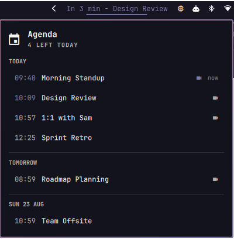

# Agenda

An Omarchy bar widget that counts down to your next meeting and opens a
keyboard-navigable agenda popup. Calendar data comes from
[gcalcli](https://github.com/insanum/gcalcli).



```
In 3 min - Design Review     ← bar label, colored by how soon it is
```

## Requirements

- [Omarchy](https://omarchy.org/) with `omarchy-shell`
- `gcalcli`, authorized against your Google account
- `python3`

```bash
uv tool install gcalcli          # or: pipx install gcalcli
gcalcli list                     # authorize, and confirm it works
```

The helper looks for `gcalcli` in `~/.local/bin` first and falls back to
`PATH`. That order is deliberate: an abandoned virtualenv can leave a
`gcalcli` shim whose interpreter no longer exists, and it would otherwise
shadow the working install.

## Install

The directory name must match the plugin id, `censey.agenda`:

```bash
git clone https://github.com/censey/omarchy-agenda \
  ~/.config/omarchy/plugins/censey.agenda

omarchy-shell shell rescanPlugins
omarchy plugin enable censey.agenda
omarchy bar move censey.agenda --section right --index 0
```

Then set your calendars (see [Settings](#settings)). Left unset, the widget
shows every calendar `gcalcli` knows about.

## Uninstall

```bash
omarchy plugin disable censey.agenda
rm -rf ~/.config/omarchy/plugins/censey.agenda
omarchy-shell shell rescanPlugins
```

Remove the `censey.agenda` entry from `bar.layout` in
`~/.config/omarchy/shell.json` if it is still listed. The plugin writes
nothing outside its own directory and changes no other configuration.

## Interactions

| Input | Action |
|---|---|
| Left click | Open/close the agenda popup |
| Right click | Refresh now |
| Middle click | Open the next meeting's link |
| `j` / `k` / arrows | Move through the agenda |
| `Enter` | Open the highlighted meeting |
| `r` | Refresh |
| `Esc` | Close |

Rows marked 󰕧 have a video link; clicking any row opens its meeting link,
falling back to the Google Calendar event page.

## Urgency

The bar label is colored from the active theme's roles, so it tracks theme
changes rather than fixed values:

| Time to start | Color | |
|---|---|---|
| ≤ 2 min | `urgent` | pulses |
| ≤ 5 min | `accent` | |
| ≤ 15 min | `foreground` | |
| further out | dimmed foreground | |
| in progress | `foreground` | row shows `now` |

A meeting stays "critical" for two minutes after it starts — the window in
which you are late for it.

## Settings

Set these inline on the widget's entry in `~/.config/omarchy/shell.json`:

```json
{ "id": "censey.agenda",
  "calendars": ["Work", "personal@gmail.com"],
  "interval": 60,
  "maxTitle": 25,
  "limit": 10 }
```

| Key | Default | Meaning |
|---|---|---|
| `calendars` | every calendar | gcalcli calendar names |
| `interval` | `60` | Seconds between fetches (15–3600) |
| `maxTitle` | `25` | Characters before the bar label is elided |
| `limit` | `10` | Upcoming events fetched. Meetings already underway are always kept, on top of this |

Countdowns are recomputed locally every 10s, so "In 3 min" stays honest
between fetches.

## Behavior notes

- All-day events are skipped — they are not meetings you can be late for.
- Declined events are excluded (`gcalcli --nodeclined`).
- The agenda spans gcalcli's rolling window, so it can reach a few days out;
  the popup groups by day.
- A meeting already underway sorts last for the bar (which counts down to the
  next thing you must get to) but renders in time order in the popup.

## Layout

| File | Role |
|---|---|
| `Panel.qml` | Bar label and agenda popup |
| `Service.qml` | Polls the helper, publishes parsed results |
| `Model.js` | Countdown, urgency, and day grouping — no QML dependencies |
| `scripts/agenda.py` | gcalcli → JSON |

## Tests

```bash
python3 -m unittest discover -s tests   # helper
node --test tests/model.test.js         # presentation logic
```

## Gotchas

- Editing `Model.js` alone may not take effect: QML caches imported JS. Run
  `omarchy restart shell` if a change to it seems ignored.
- Stale widget instances from earlier hot-reloads keep the IPC target
  registered, so `omarchy-shell censey.agenda …` can reach an old one.
  Restart the shell when IPC results look stale.

## License

MIT — see [LICENSE](LICENSE).
